### 1.1. Запуск проекта 
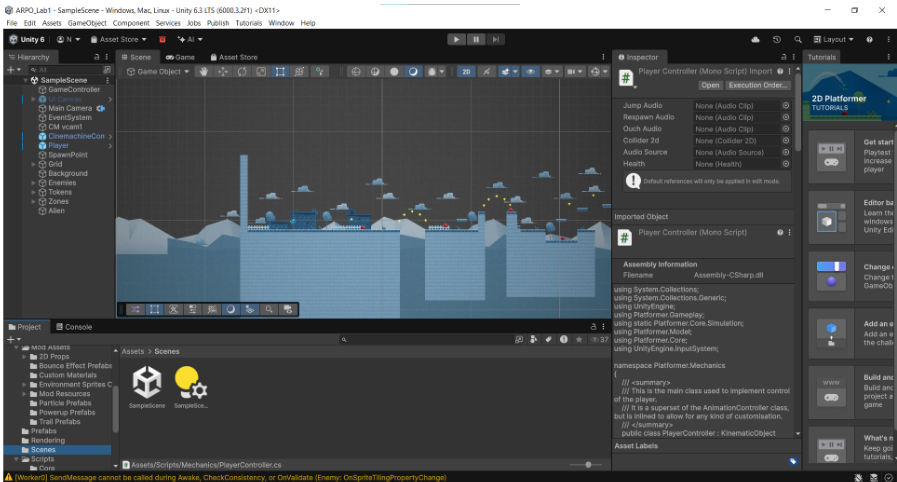

### 1.2. Создание скрипта сборщика 
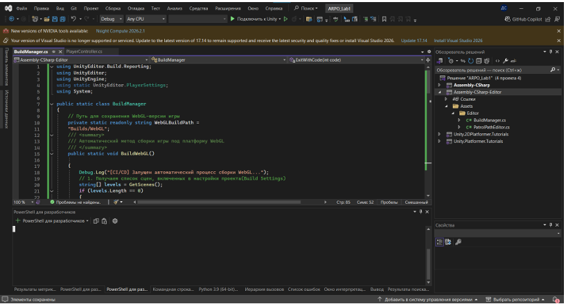

### 1.3. Отключение сжатия для WebGL
Compression Format = Disabled.

### 1.4. Успешная сборка проекта 
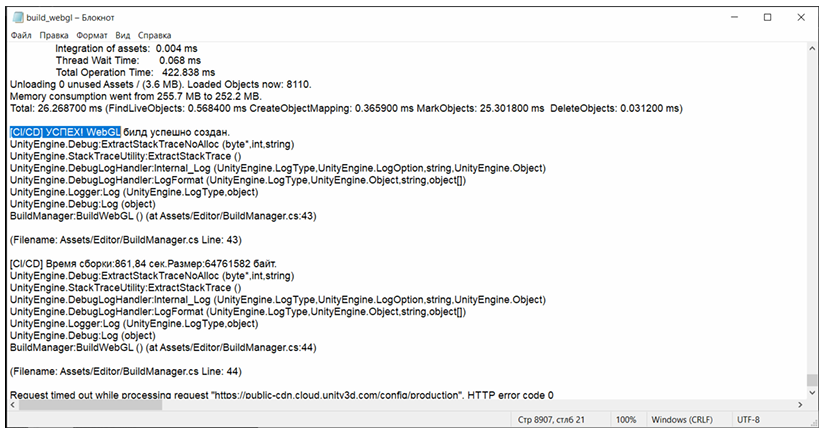

### 1.5. Файлы билда 
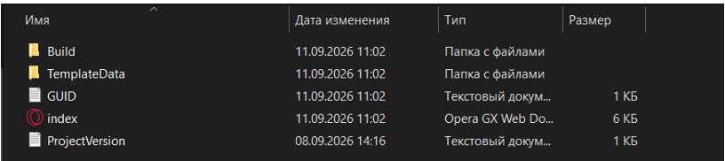

### 1.6. Успешный запуск игры в браузере
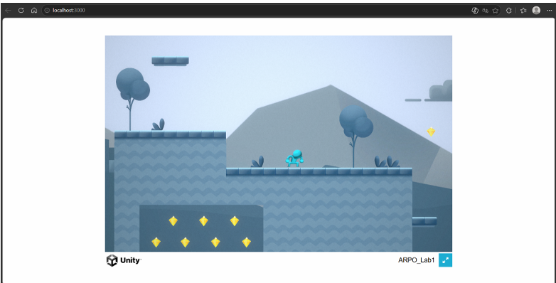

### 1.7. Созданный .gitignore
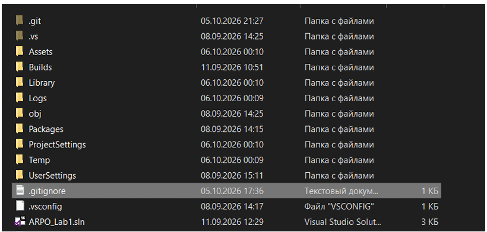

### 1.8. Инициализация репозитория
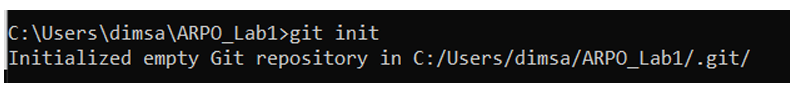

### 1.9. Создание главной ветки и добавление файлов 
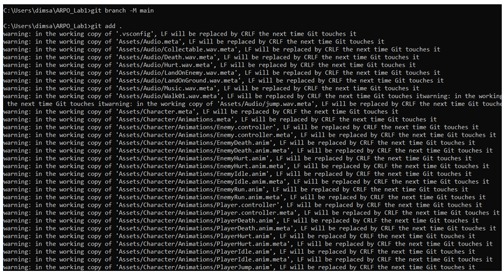

### 1.10. Создание коммита 
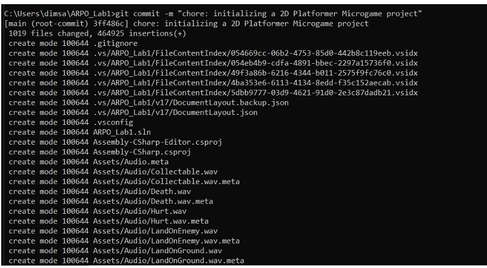

### 1.11. Привязка к удаленному репозиторию 
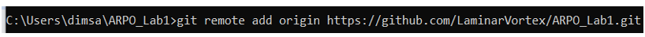

### 1.12. Отправление ветки 
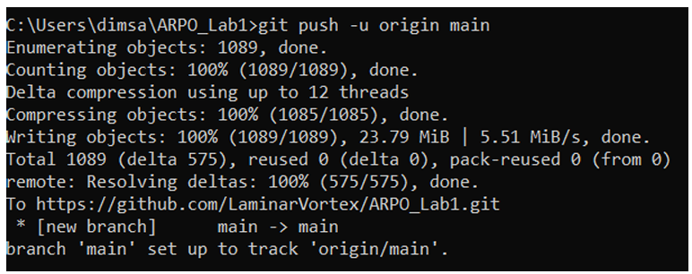

### 1.13. Переключение на новую ветку и добавление BuildManager 
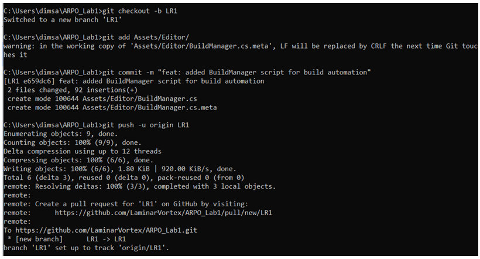

### 1.14. Добавление README.md  
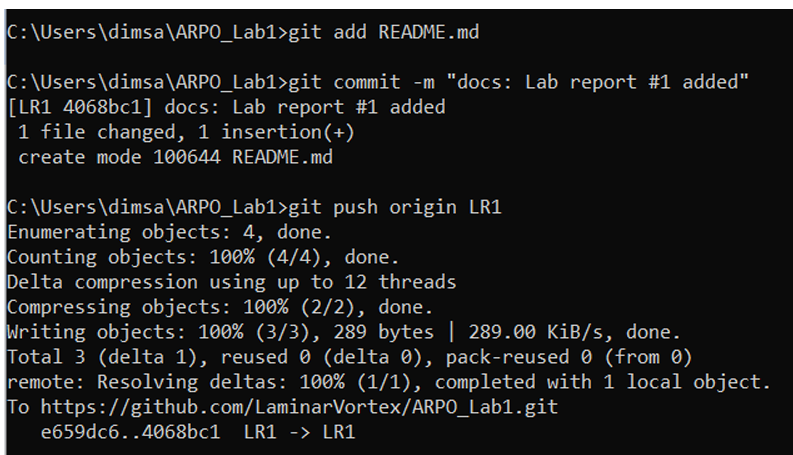

### 1.15. Получение аппрувов от ревьюверов 
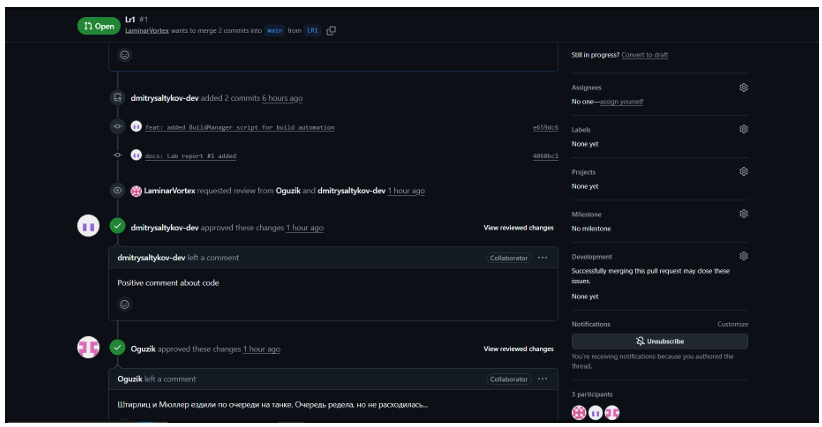

### 1.16. Успешное объединение кода 
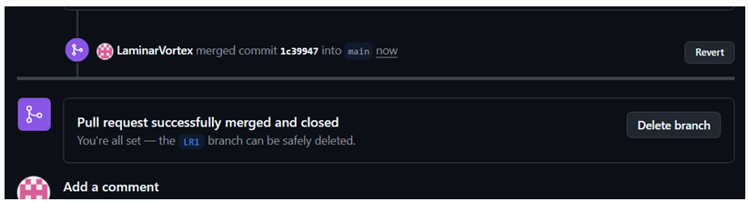

### 2.1 Создание нового репозитория
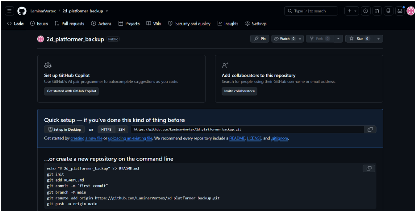

### 2.2 Сохранение токена в секреты проекта 
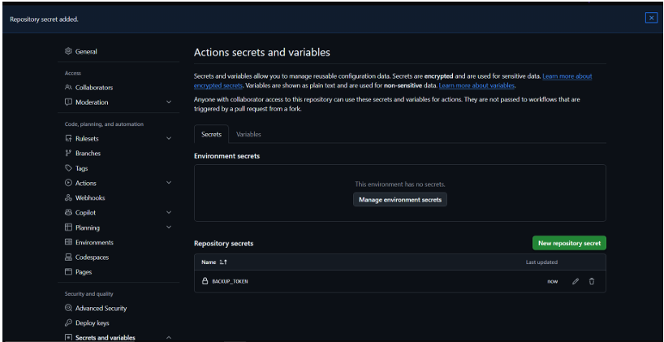

### 2.3 Создание YAML файла 
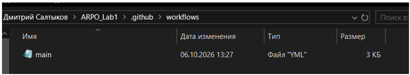

### 2.4 Отправка пайплайна на GitHub 
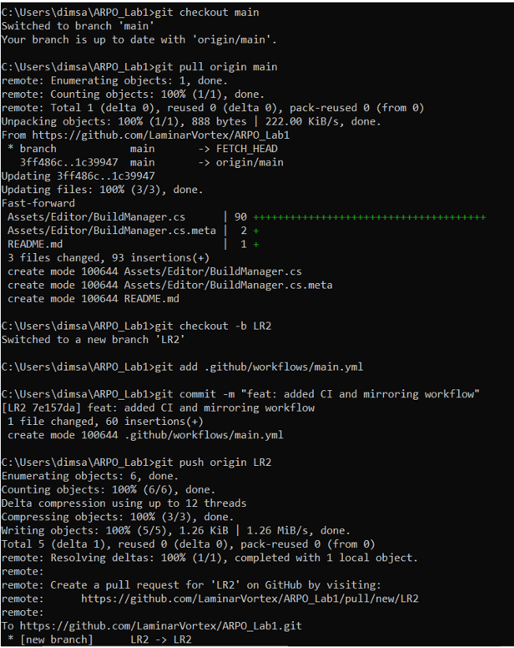

### 2.5 Успешное прохождение sanity_check и mirror_repo 
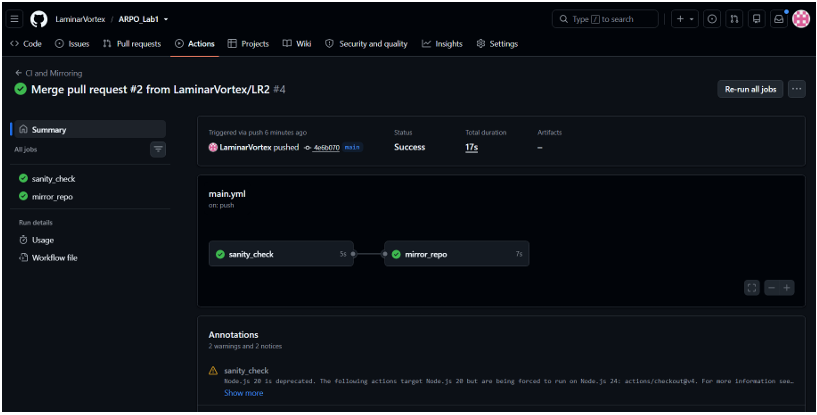

### 2.6 Резервный репозиторий 
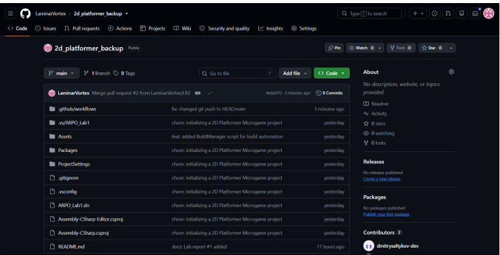